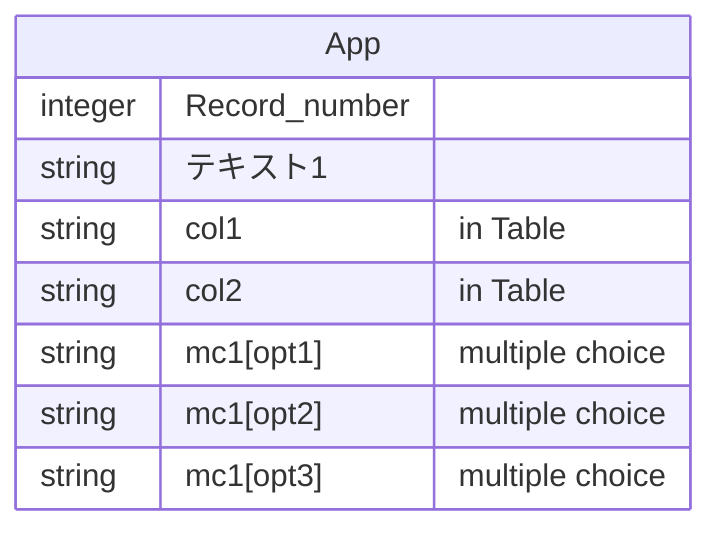
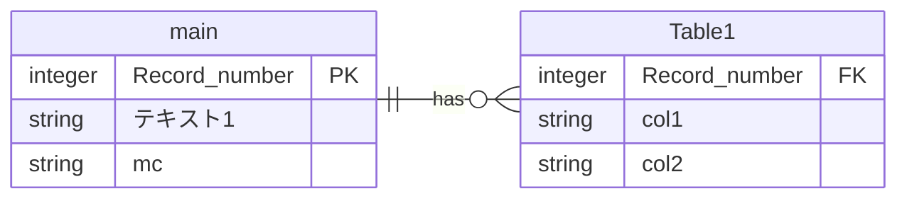

# kintone-tabulax

A utility for kintone's CSV, now it normalize and unpivot table

## Problem to solved

The CSV exported from kintone will be in the form that the “table” item is normalized and joined, while the columns that accept input for multiple choices that should correspond to 1:n will have a structure that extends horizontally as entity-attribute-value. This is very enigmatic structure.

( I guess it cannot be avoided it to express kintone's ultra-flexible data structure in One-True-CSV )

Record number | テキスト1 | col1       | col2      | mc1[opt1] | mc1[opt2] | mc1[opt3]
--------------|----------|------------|-----------|-----------|----------|---
1             | あああ    | テーブル内1 | テーブル内2 | 1         | 1        |
1             | あああ    | テーブル内3 | テーブル内4 | 1         | 1        |

(kintone's CSV has enigmatic structure)



This makes it very incompatible with SQL-based aggregation and forces you to assemble complex functions in Excel / Spreadsheet that are not easy to maintain.

### Solution

To solve above problems, this utility reorganize all of exported CSV ( represented as key-value array )  into a vertical structure for SQL-friendly, and the “table” items are separated into real tables.



`main`

Record number | テキスト1 | mc1
--------------|----------|------
1             | あああ    | opt1
1              | あああ    | opt2

`Table1`

Record number | col1      | col2
--------------|-----------|-----------
1             | テーブル内1 | テーブル内2
1             | テーブル内3 | テーブル内4

When actually aggregating them, you should define the composite primary key yourself and `group by` with them, since there no sarrogate keys in the fields in the `Table`.

## Usage

### Node.js Usage

```bash
npm install kintone-tabulax
```

```javascript
import { KintoneTabulax } from 'kintone-tabulax';

// Define table definitions and multi-choice columns
const tableDefinitions = {
  Table1: ['テキスト項目'],
  Table2: ['Text', 'Drop-down']
};

const multiChoiceColumns = {
  main: ['単純複数選択'],
  Table1: ['複[]数選択', 'Table1_Check box'],
  Table2: ['Multi-choice']
};

const tabulax = new KintoneTabulax({ tableDefinitions, multiChoiceColumns });

// Parse your CSV data to get records
// const records = await parseCsv(csvString);

// Generate unpivoted data
const result = tabulax.normanpivot(records);
```

### Google Apps Script Usage

Copy and paste kintone-tabulax.gas.js.

```javascript
/**
 * ex) use with SpreadsheetOnetimeReader
 *
 * see https://github.com/colorfulcompany/gas-spreadsheet-onetime-reader
 **/
function myFunction() {
  const reader = SpreadsheetOnetimeReader.createReader(SpreadsheetApp)
  const records = reader.toObject()

  // Define your configuration
  const tableDefinitions = {
    // your table definitions
  };

  const multiChoiceColumns = {
    // your multi-choice columns
  };

  // Create tabulax instance
  const tabulax = createKintoneTabulax({
    tableDefinitions, multiChoiceColumns,
  })

  // Use with your data
  const result = tabulax.normanpivot(records);
}
```

## Configuration

type

```typescript
type KintoneTabulaxConfiguation = {
  tableDefinitions?: Record<TableName, ColumnName[]>;
  multiChoiceColumns?: Record<TableName, ColumnName[]>;
  primaryKey?: string;
}
```

### primaryKey

ex)

```javascript
{ primariKey: 'レコード番号' }
```

Kintone's predefined primary field name is determined automatically when you create an app **following your language setting**, althought not mentioned in the official documents as of April 2025. It cannot be changed later.

### Table Definitions

ex)

```javascript
{
  TableName1: ['ColumnName1', 'ColumnName2', ...],
  TableName2: ['ColumnNameA', 'ColumnNameB', ...]
}
```

### multiChoiceColumns

ex)

```javascript
{
  TableName1: ['MultiChoiceColumn1', 'MultiChoiceColumn2', ...],
  TableName2: ['MultiChoiceColumnNameA', 'MultiChoiceColumnB', ...]
}
```

## Requisites to develop

 * awk
 * bash
 * Deno
